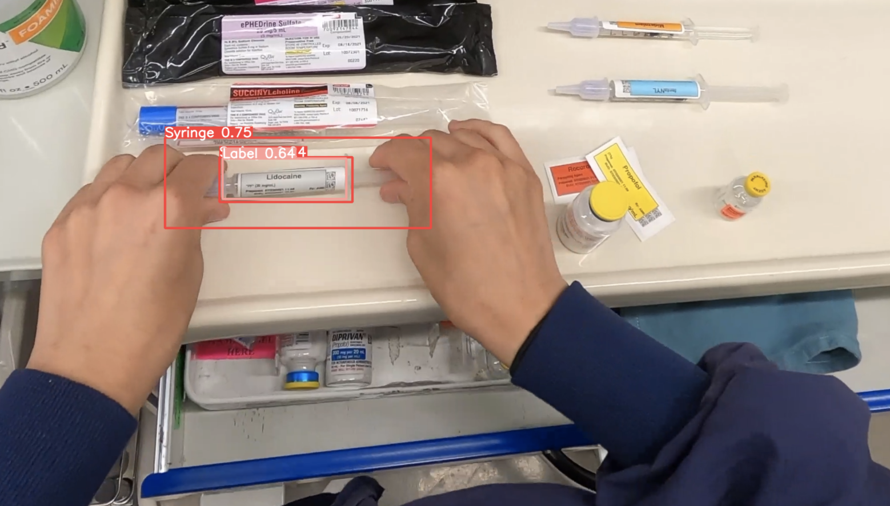
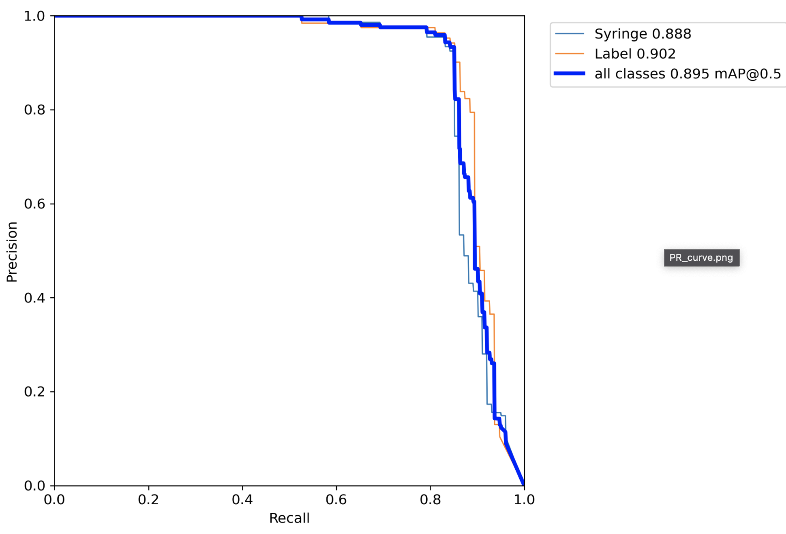

<details open>
<summary>Install</summary>


```bash
git clone https://github.com/surgicaldrugdataset/dataset-for-surgical-drug-preparation.git # clone
cd syringe-and-syringe-label-identification-neural-net/src
pip install -r requirements.txt  # install
```

</details>


<details>
<summary>Inference with detect.py</summary>

`detect.py` runs inference on a variety of sources, getting models as requested from surgicaldrugdataset@gmail.com and saving results to `runs/detect`.

```bash
python detect.py  --weights models/best_syringe_syringeLabel.pt --img 416 --source 0  # webcam
                          img.jpg  # image
                          vid.mp4  # video
                          path/  # directory
                          path/*.jpg  # glob
                          'https://youtu.be/Zgi9g1ksQHc'  # YouTube
                          'rtsp://example.com/media.mp4'  # RTSP, RTMP, HTTP stream
```

</details>

<details>
<summary>Training</summary>


```bash
python train.py --data data.yaml --cfg yolov5n.yaml --weights '' --batch-size 128
                                       yolov5s                                64
                                       yolov5m                                40
                                       yolov5l                                24
                                       yolov5x                                16
```



</details>
